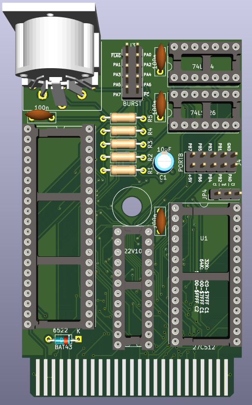

# BurstCart - Fast serial cartridge for C16/116/Plus4

This Plus/4 cartridge implements both fast serial burst for 1570/1571/1581 drives and a parallel connection for the 1541 drive, enabling high-speed data transfers.

## About

The project started as a response to a question from **[Plus/4 World Forum](https://plus4world.powweb.com/forum.php?postid=52378)**.

In order to use the Burst (fast serial) protocol as implemented on the C128, we need a bidirectional hardware serial port.

The published version uses VIA 6522 chips, which are still relatively easy to obtain. The additional logic addresses a VIA hardware bug that can lead to framing errors and lost bits when the serial port is externally clocked, as is the case with the fast serial burst protocol.

The single IEC port should be connected to the pass-through serial port on the last disk drive in the chain, looping back to the computer.

VIA Port A and lines CA1/CA2 are also used as a parallel connection for 1541 parallel burst with hardware handshake. The order of signals on the J3 connector for a ribbon cable is compatible with parallel cables known from the C64, particularly DolphinDOS.

VIA Port B is not used, except for bit 0, which controls the direction of the serial port.

Other attempts included in the repository are:

### CPLD

This is an attempt to drop legacy chips altogether.

Due to the limited number of gates, it only implements small parts of the CIA, such as timer A with a fixed rate, the hardware serial port, and the status register. The implementation does only what it necessary to make burst protocol work: to be able to send a byte via burst to enable burst protocol and to receive bytes on serial port with external clock.

### CIA (6526) - abandoned

This seemed obvious as CBM themselves added CIA just for this purpose to 1571. However, the timing differences made it impossible to use the CIA reliably with the screen on.

These chips are also hard to obtain.

The PCB had enough space for two IEC ports as a passthrough.

## Hardware

### VIA

KiCad 6.0 project files are available in the [`burstcart-via/kicad/`](burstcart-via/kicad/) directory.

Schematic is available as [`burstcart-via.pdf`](burstcart-via/kicad/plots/burstcart-via.pdf) in the `burstcart-via/kicad/plots/` directory.

Gerber files for manufacturing are available from [`burstcart-via/kicad/plots/`](burstcart-via/kicad/plots/) directory.

### CPLD

KiCad 6.0 project files are available in the [`burstcart-cpld/kicad/`](burstcart-cpld/kicad/) directory.

Schematic is available as [`burstcart-cpld.pdf`](burstcart-cpld/kicad/plots/burstcart-cpld-44.pdf) in the `burstcart-cpld/kicad/plots/` directory.

Gerber files for manufacturing are available from [`burstcart-cpld/kicad/plots/`](burstcart-cpld/kicad/plots/) directory.

## Firmware 

### VIA

The firmware for the GAL22V10 programmable logic device is provided as a compiled JEDEC file [`BURSTCART-VIA.jed`](burstcart-via/gal/BURSTCART-VIA.jed).

The source code for the GAL logic is written in CUPL and available as [`burstcart-via.pld`](burstcart-via/gal/burstcart-via.pld). This file contains the logic equations that implement the address decoding and serial port direction control.

The GAL firmware fixes VIA's address at `$FDA0-$FDAF` range.

### CPLD

The CPLD firmware is also provided as a compiled JEDEC file [`CIA.jed`](burstcart-cpld/hdl/ciasdr-hdl/cia.jed).

The source code is written in Verilog for XILINX ISE. All the project files are provided in [`ciasdr-hdl`](burstcart-cpld/hdl/ciasdr-hdl).

The firmware fixes CPLD address at `$FD90-$FD9F` range.

## Software

### EPROM

The GAL chip on the VIA version does not have enough space to support 64K ROMs as C1/C2 cartridges, so only 32K is visible to the computer at any given time as C1.

You can use 32K chips; for the 64K version, the 32K banks can be selected using a switch connected to JP4.

The CPLD version can address both C1 and C2 cartridges, so all 64K is available.

The **[Parobek](https://github.com/ytmytm/plus4-parobek)** project provides a ROM that supports various fastloaders for BurstCart:

- autodetected fast serial burst for 1570/1571/1581
- parallel cable loader for 1541
- even faster parallel cable loader for 1541 with [1541-RAMBOard](https://github.com/ytmytm/1541-RAMBOardII) patched ROM
- [tcbm2sd fastloader](https://github.com/ytmytm/plus4-tcbm2sd) for both device numbers
- 1551 fastloader for both device numbers
- DOS wedge
- embedded Directory Browser

Be sure to choose correct ROM version - for VIA or CPLD.

## VIA PCB jumpers

There are three jumpers on the VIA PCB:

- JP1 determines how the `/IRQ` line is connected to the VIA. For W65C22S, it should go through a diode; for all other 6522 versions, it can be connected directly, and `D1` can be omitted.
- JP2 chooses the clock for VIA - `phi0` or `phi2` (default)
- JP3 chooses the clock for GAL - `phi0` (default) or `phi2`
- JP4 controls line A15 for the EPROM and chooses which 32K half of a 64K ROM will appear as cartridge C1

## Theory of operation

### Fast serial

The burst mode protocol were originally developed by Commodore for the C128 and 1571/1581 drives. It uses the hardware serial port available on VIA and CIA chips. The data is transmitted over the IEC data line, with the hardware clock controlled by the sender and routed through the (otherwise unused) SRQ line. Changes in the IEC clock line are used as a handshake signal.

This was not available on the 1541 due to a hardware bug in the 6522 chips.

This project fixes the bug with a 74LS74 latch. Another 74LS126 chip is needed to buffer the input/output and provide the necessary open collector outputs on the external side for both the clock and data lines. The direction of the bus is controlled by port B bit 0 (PB0) pulled high to make it input as a default after reset.

The single IEC port on the VIA cartridge has only the hardware data and clock lines connected, as well as a common GND.

The CPLD cartridge has dual daisy-chained IEC ports, so you can connect the computer's serial port to cartridge and continue from the second port to all other IEC devices.

### Parallel cable

The 1541 drive's VIA#1 port A is unused. On the C64, this is connected to the User Port, along with two hardware handshake lines, providing the fastest possible connection between the VIA and CIA.

Here we connect it to port A as well. Note that on the BurstCart side, the handshake lines are connected to CA1/CA2 corresponding to port A, but to CA2/CB1 on the 1541 side. This is not symmetrical because on the 1541, CA1 from VIA#1 was already used for another purpose.

## Additional Resources

All files necessary for manufacturing, including Gerbers, schematic, GAL firmware, and ROM, can be found in the [GitHub releases section](https://github.com/ytmytm/plus4-burstcart/releases).
